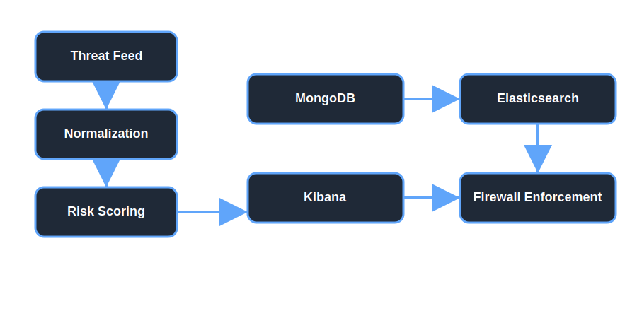
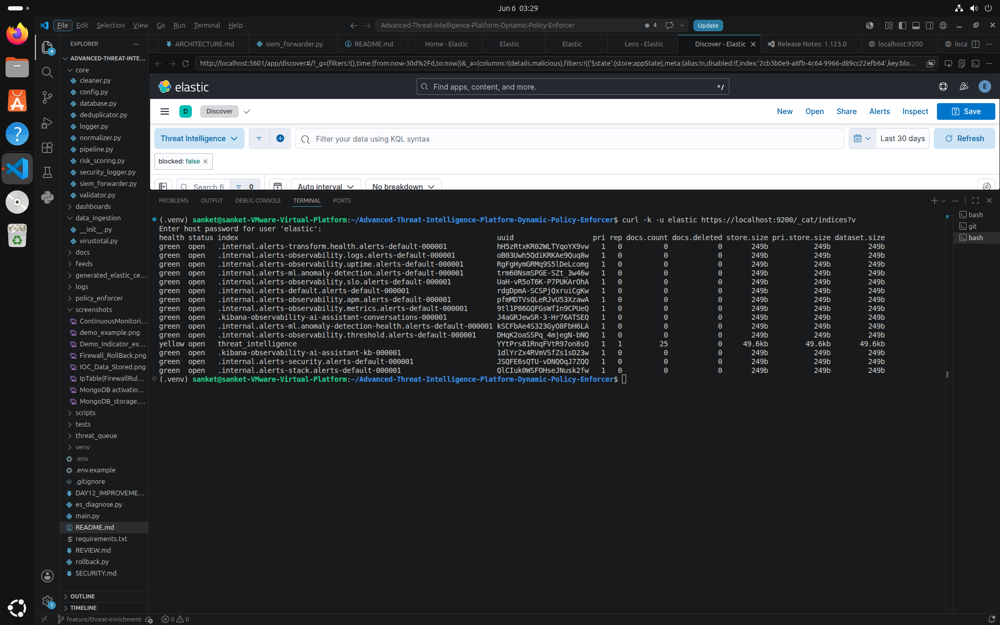
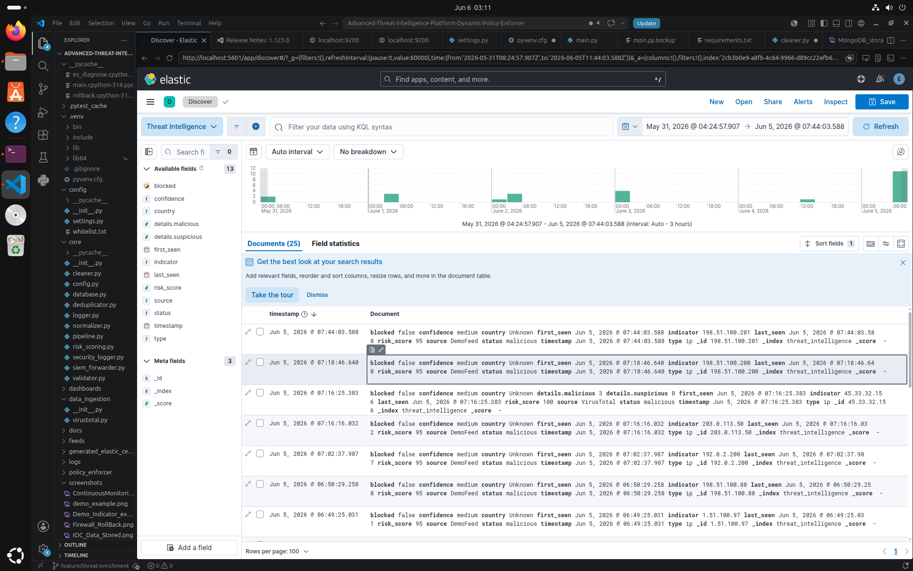

# Advanced Threat Intelligence Platform & Dynamic Policy Enforcer

A production-ready threat intelligence automation platform that ingests malicious IOC data from OSINT feeds, normalizes and deduplicates indicators, assigns risk scores, stores them in MongoDB, automatically enforces firewall blocking via iptables, and generates SIEM-ready audit logs for SOC compliance.

## 🎯 Project Overview

This platform automates the entire threat intelligence lifecycle:
- **Ingest** malicious IOCs from VirusTotal, AlienVault OTX, and AbuseIPDB
- **Normalize** indicator format and validate indicators
- **Deduplicate** entries before storage
- **Score** threats based on feed reputation and metadata
- **Store** data in MongoDB for persistence and auditing
- **Forward** security events to Elasticsearch for Kibana visualization
- **Enforce** firewall policies automatically for high-risk threats

## 💼 Architecture

The core processing flow is:

```
Threat Feed
    ↓
Normalization
    ↓
Risk Scoring
    ↓
MongoDB
    ↓
Elasticsearch
    ↓
Kibana
    ↓
Firewall Enforcement
```



## ✨ Features

- ✅ **Multi-Feed OSINT Integration** - VirusTotal, AlienVault OTX, AbuseIPDB
- ✅ **IOC Normalization** - Supports IP addresses, domains, and file hashes
- ✅ **Intelligent Deduplication** - MongoDB-based duplicate detection
- ✅ **Dynamic Risk Scoring** - 60-95 point scale based on feed source
- ✅ **MongoDB Persistence** - Proper schema with timestamps and metadata
- ✅ **Automatic Firewall Enforcement** - iptables rules for high-risk IPs
- ✅ **SIEM-Ready Logging** - Structured security events for ELK/Kibana
- ✅ **TLS-safe Elasticsearch Forwarding** - CA certificate validation with diagnostics
- ✅ **Rollback CLI** - Command-line unblock and rollback support
- ✅ **CLI Interface** - Professional argparse-based command-line tool
- ✅ **Error Handling** - Comprehensive exception handling and logging
- ✅ **Demo Mode** - Safe testing without requiring API keys

## 🛠 Installation

```bash
# Clone the repository
git clone https://github.com/tryhackmeacct-netizen/Advanced-Threat-Intelligence-Platform-Dynamic-Policy-Enforcer.git
cd Advanced-Threat-Intelligence-Platform-Dynamic-Policy-Enforcer

# Create virtual environment
python3 -m venv .venv
source .venv/bin/activate

# Install dependencies
pip install -r requirements.txt

# Ensure MongoDB is running
sudo systemctl start mongod
```

## ⚙️ Configuration (.env)

Create a `.env` file in the project root:

```bash
# .env file
MONGO_URI=mongodb://localhost:27017/
DB_NAME=threat_intelligence
COLLECTION_NAME=ioc_data

# Elasticsearch TLS / authentication settings
ELASTICSEARCH_URL=https://localhost:9200
ELASTICSEARCH_CA_CERT_PATH=/etc/elasticsearch/certs/http_ca.crt
ELASTICSEARCH_USER=elastic
ELASTICSEARCH_PASSWORD=your_elastic_password

# OSINT Feed API Keys
VIRUSTOTAL_API_KEY=your_virustotal_api_key
ALIENVAULT_API_KEY=your_alienvault_api_key
ABUSEIPDB_API_KEY=your_abuseipdb_api_key

# Feed Configuration
DEFAULT_FEED_INDICATORS=203.0.113.10,198.51.100.20,192.0.2.20
ENABLE_DEMO_FALLBACK=1
```

## ▶️ Running the Project go to --> ( docs/VERIFICATION_GUIDE.md )

### Run the main application

```bash
python3 main.py --mode demo --indicators 203.0.113.10 198.51.100.20
```

### Run live ingestion

```bash
python3 main.py --mode live --indicators 8.8.8.8 1.1.1.1
```

### Use the policy CLI

```bash
python3 scripts/policy_cli.py start-daemon --interval 15
python3 scripts/policy_cli.py rollback 203.0.113.99 --reason "false_positive"
```

## 📸 Screenshots

### Elasticsearch Index Status


### Kibana Discover


### Architecture Diagram


## 📊 Deployment Validation Results

The platform has been successfully deployed, tested, and validated across all major components.

### Validation Summary

| Component | Status |
|------------|---------|
| Threat Intelligence Collection | ✅ PASS |
| IOC Validation & Normalization | ✅ PASS |
| Risk Scoring Engine            | ✅ PASS |
| MongoDB Integration            | ✅ PASS |
| Elasticsearch Integration      | ✅ PASS |
| Kibana Integration             | ✅ PASS |
| Firewall Enforcement           | ✅ PASS |
| Rollback Mechanism             | ✅ PASS |
| Monitoring Daemon              | ✅ PASS |
| Security Logging               | ✅ PASS |
| Documentation                  | ✅ PASS |
| Security Controls              | ✅ PASS |

### Test Execution Results

|     Metric       | Result |
|------------------|--------|
| Total Test Cases |   26   |
| Passed           |   26   |
| Failed           |    0   |
| Success Rate     |  100%  |

### Elasticsearch Validation

- Elasticsearch Version: **8.13.4**
- Authentication Enabled: **Verified**
- HTTPS/TLS Enabled: **Verified**
- Threat Intelligence Index: **Operational**
- Indexed Threat Records: **25+ Documents**

### Kibana Validation

- Kibana Service: **Operational**
- Login Interface Accessible: **Verified**
- Elasticsearch Connectivity: **Verified**
- Threat Intelligence Dashboards: **Verified**

### Security Validation

- No secrets tracked in Git
- Environment-based configuration implemented
- TLS-secured Elasticsearch communication
- Security event logging operational

### Firewall Validation

- Automatic IP blocking verified
- Whitelist protection verified
- Rollback functionality verified
- Administrative permission handling verified

### Monitoring Validation

- Continuous monitoring daemon operational
- Security event logging operational
- Health monitoring operational

## 🔐 Security Considerations

- Keep `.env` files local and out of source control.
- Use strong, rotated credentials for Elasticsearch and MongoDB.
- Prefer secret management systems for production deployments.
- Do not hardcode credentials or API keys in code.
- Enforce least privilege for database and Elasticsearch users.
- Audit firewall changes and SIEM logs for suspicious activity.

## 🚀 Future Improvements

- Add reusable Kibana dashboard templates for threat visualization.
- Support additional OSINT feeds such as URLHaus and PhishTank.
- Add container-native deployment with Docker and Kubernetes.
- Implement automated policy validation and rollback testing.
- Add centralized secrets management integration.

## 📊 OSINT Feeds

### Supported Threat Intelligence Sources

| Feed | API | Risk Score | Details |
|------|-----|-----------|---------|
| **VirusTotal** | Commercial | 90 | Malware detection, 70+ AV engines |
| **AlienVault OTX** | Free | 85 | Pulse data, community threat intel |
| **AbuseIPDB** | Free/Pro | 80 | IP reputation, abuse scoring |
| **DemoFeed** | Demo | 95 | Safe testing without API keys |

## 💯 Risk Scoring

Risk scores are assigned based on the threat feed source:

```python
DemoFeed → 95 (Highest - Test Data)
VirusTotal → 90 (Commercial Intelligence)
AlienVault → 85 (Community Threat Data)
AbuseIPDB → 80 (IP Reputation)
Default → 60 (Unknown Source)
```

**Firewall Enforcement Threshold:** ≥ 80 (automatically blocks all indicators scoring 80 or higher)

## 🔧 Advanced Commands

### Start the Enforcement Daemon
```bash
python3 scripts/policy_cli.py start-daemon --interval 15
```

### Run Rollback CLI
```bash
python3 scripts/policy_cli.py rollback 91.219.236.222 --reason "false_positive"
```

### Check MongoDB Database
```bash
# Count total IOCs
python3 << 'EOF'
from pymongo import MongoClient
client = MongoClient("mongodb://localhost:27017/")
collection = client["threat_intelligence"]["ioc_data"]
print(f"Total IOCs: {collection.count_documents({})}")
EOF

# View MongoDB with mongosh
mongosh
use threat_intelligence
db.ioc_data.find().pretty()
db.ioc_data.countDocuments()
```

### Check Firewall Rules
```bash
sudo iptables -L INPUT -n | grep DROP
sudo iptables -S
```

### Check Security Logs
```bash
tail -20 logs/security_events.log
tail -20 logs/ingestion.log
```

### Check MongoDB service status
```bash
sudo systemctl status mongod
```

If the CA certificate is not readable by the application user, fix permissions:
```bash
sudo chmod 755 /etc/elasticsearch /etc/elasticsearch/certs
sudo chmod 644 /etc/elasticsearch/certs/http_ca.crt
```

If the certificate is stored in a different location, set:
```bash
export ELASTICSEARCH_CA_CERT_PATH=/path/to/http_ca.crt
```

To keep verification enabled by default, no additional configuration is required. If you must temporarily bypass TLS validation while regenerating the CA certificate, set:
```bash
export ELASTICSEARCH_VERIFY_CERTS=0
```

To allow the application to retry insecurely only when strict TLS validation fails because the CA lacks the Key Usage extension, also set:
```bash
export ELASTICSEARCH_ALLOW_INSECURE_FALLBACK=1
```

### Regenerating Elasticsearch HTTP certificates
A fixed CA certificate and HTTP server keystore have been generated in the repository under `generated_elastic_certs`.

Run the installer script to regenerate and install the fixed certificates:
```bash
cd /home/sanket/Advanced-Threat-Intelligence-Platform-Dynamic-Policy-Enforcer
./scripts/install_elasticsearch_certs.sh
```

Then restart Elasticsearch and verify `ELASTICSEARCH_VERIFY_CERTS=1` is enabled.

## 📋 Expected Outputs

### Demo Mode Successful Run
```
2026-05-27 07:09:29,628 | INFO | tip_ingestion | Starting Threat Intelligence Platform [MODE=DEMO, INDICATORS=3]
2026-05-27 07:09:29,641 | INFO | tip_ingestion | Stored IOC 203.0.113.99 from DemoFeed
✓ 203.0.113.99 (ip) - Risk: 95 - Source: DemoFeed
✓ 198.51.100.99 (ip) - Risk: 95 - Source: DemoFeed
✓ 192.0.2.99 (ip) - Risk: 95 - Source: DemoFeed
[SUCCESS] Processed 3 IOCs
```

### MongoDB Document Schema
```json
{
  "indicator": "203.0.113.99",
  "type": "ip",
  "source": "DemoFeed",
  "risk_score": 95,
  "status": "malicious",
  "timestamp": "2026-05-27T07:09:29.641000",
  "details": {}
}
```

### Firewall Rule Example
```bash
$ sudo iptables -L INPUT -n | grep 203.0.113.99
DROP       all  --  203.0.113.99        0.0.0.0/0
```

### Security Event Log Format
```
2026-05-27 11:09:29 | EVENT=MALICIOUS_IP_DETECTED | IP=203.0.113.99 | SOURCE=DemoFeed | RISK=95 | ACTION=DETECTED
2026-05-27 11:09:29 | EVENT=FIREWALL_BLOCK | IP=203.0.113.99 | SOURCE=DemoFeed | RISK=95 | ACTION=BLOCKED
```

## 📚 Documentation

For a comprehensive project review guide with all commands, week-by-week breakdown, and testing checklist, see **[REVIEW.md](REVIEW.md)**

Key sections in the review guide:
- ✅ Week-by-week implementation details
- ✅ All review and demo commands with expected outputs
- ✅ Architecture diagram and data flow
- ✅ Technologies stack and key features
- ✅ Testing checklist for interviews
- ✅ Key points for your project presentation
- ✅ Next enhancement steps

## 🏗️ Architecture & Design

### Pipeline Stages

1. **Ingestion** - Fetch IOCs from configured OSINT feeds or demo data
2. **Normalization** - Standardize format, infer type (IP/Domain/Hash)
3. **Deduplication** - Query MongoDB to detect existing indicators
4. **Risk Scoring** - Assign risk score based on feed source (60-95)
5. **Storage** - Insert normalized IOC into MongoDB with metadata
6. **Firewall** - Evaluate risk score; if ≥80, add iptables DROP rule
7. **Logging** - Log all events to both application and security logs

### Database Schema

**Collection:** `ioc_data` in `threat_intelligence` database

```javascript
{
  "_id": ObjectId,
  "indicator": String,        // IP, domain, or hash
  "type": String,             // "ip", "domain", or "hash"
  "source": String,           // Feed source (VirusTotal, AlienVault, etc.)
  "risk_score": Integer,      // 60-95 scale
  "status": String,           // "malicious"
  "timestamp": String,        // ISO 8601 format
  "details": Object           // Feed-specific metadata
}
```

### Security Event Logging

**File:** `logs/security_events.log` (SIEM-compatible)

**Format:** `TIMESTAMP | EVENT=TYPE | IP=INDICATOR | SOURCE=FEED | RISK=SCORE | ACTION=STATUS`

**Event Types:**
- `MALICIOUS_IP_DETECTED` - New malicious indicator discovered
- `FIREWALL_BLOCK` - iptables rule successfully created
- `FIREWALL_BLOCK_FAILED` - iptables rule creation failed (no sudo)

## 🛠️ Technologies Used

| Component | Technology |
|-----------|-----------|
| **Language** | Python 3.8+ |
| **Database** | MongoDB 4.0+ with PyMongo |
| **Firewall** | Linux iptables |
| **Logging** | Python logging module |
| **Config** | python-dotenv |
| **OSINT APIs** | VirusTotal, AlienVault OTX, AbuseIPDB |
| **Version Control** | Git |

## 📊 Project Statistics

| Metric | Value |
|--------|-------|
| Python Files | 15+ |
| Modules | 5 |
| Core Functions | 30+ |
| OSINT Feeds | 3 |
| Security Events | 2+ types |
| Lines of Code | 500+ |
| Risk Levels | 5-6 categories |

## 📝 Notes

- **Demo Mode** - Use `--mode demo` to test without API keys
- **Live Mode** - Requires `.env` file with API keys configured
- **Deduplication** - Same IOC run twice will show "Duplicate IOC skipped"
- **Firewall** - Requires `sudo` privileges; logs `BLOCK_FAILED` if not available
- **Logging** - All events logged to both console and files for audit trail

## 🚦 Troubleshooting

### MongoDB Connection Failed
```bash
# Start MongoDB service
sudo systemctl start mongod

# Verify connection
mongosh --eval "db.adminCommand('ping')"
```

### Firewall Rules Not Created
```bash
# Check if you have sudo privileges
sudo iptables -L INPUT -n

# Look for errors in logs
grep "BLOCK_FAILED" logs/security_events.log
```

### Elasticsearch TLS / CA Diagnostics
```bash
# Check that Elasticsearch is reachable with TLS validation
python3 es_diagnose.py
```

If the CA certificate path is invalid or not readable, update `ELASTICSEARCH_CA_CERT_PATH` and verify file access.

### API Key Issues
```bash
# Verify .env file exists
cat .env

# Test feed connectivity
python3 main.py --mode live --indicators 8.8.8.8
```

## ✅ Testing Checklist

- [ ] MongoDB running and connected
- [ ] Run demo mode successfully
- [ ] Check IOC count in database
- [ ] Verify SIEM-ready security logs
- [ ] Confirm firewall rules created
- [ ] Test deduplication with duplicate indicator
- [ ] Check application logs for errors
- [ ] Validate schema of stored documents

## 📄 Author & License

**Developer:** Sanket Pawar  


## 🔗 Quick Links

- GitHub Repository: https://github.com/tryhackmeacct-netizen/Advanced-Threat-Intelligence-Platform-Dynamic-Policy-Enforcer
- Project Documentation: [docs/](docs/)
